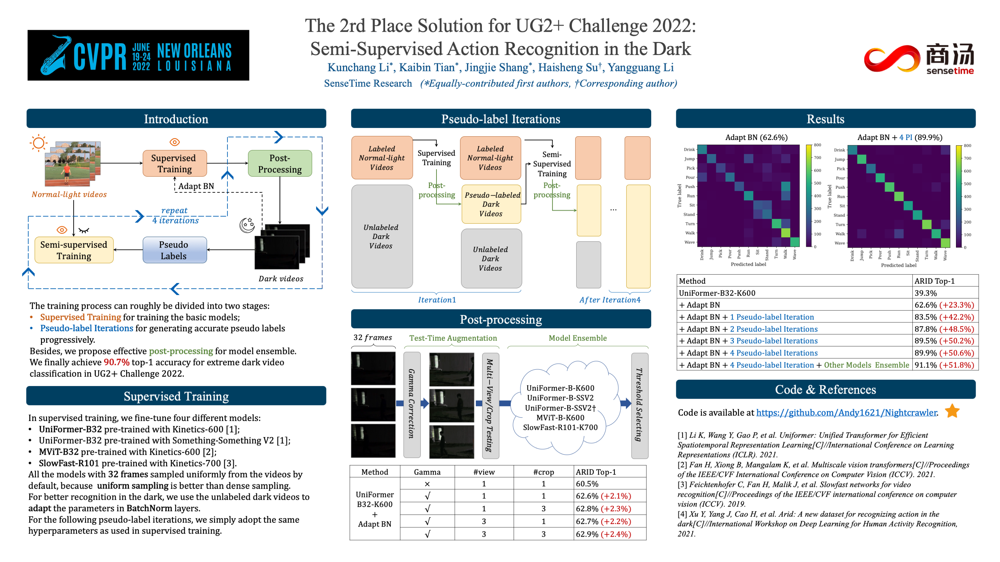

# Nightcrawler
This repo is the top-2 solution for [UG2+ 2022 Track2](http://cvpr2022.ug2challenge.org/dataset22_t2.html).
We achieve 90.7% top-1 accuracy for [extreme dark video classification](https://codalab.lisn.upsaclay.fr/competitions/1112#results).




## Introduction
Our method consists of four steps:
1. **[Supervised Training]**: Only those videos under normal light are used for training. Those dark videos are used for adapting BN.
2. **[Test-Time Augmentation]**: [Gamma Correction](https://pytorch.org/vision/stable/generated/torchvision.transforms.functional.adjust_gamma.html) is adopted to enhance dark videos, while multi-crop and multi-view sampling are used for better classification.
3. **[Model Ensemble]**: Different models are ensembled via a specific threshold to generate more accurate pseudo labels.
4. **[Semi-supervised Training]**: Those dark videos with pseudo labels are used for training.

The final three steps are used for **generating pseudo labels**, which we called **Pseudo-label Iteration**. The iteration is repeated four times, and we only select those pseudo with high confidence for training.


## Model Zoo
See [MODEL_ZOO.md](./MODEL_ZOO.md) for more details.

## Dataset
See [DATASET.md](./DATASET.md) for more details.

## Installation

Please follow the installation instructions in [INSTALL.md](INSTALL.md). You may follow the instructions in [DATASET.md](DATASET.md) to prepare the datasets.


## Training

The training process can roughly be divided into two stages, including:
   - **Supervised Training** for training the basic models;
   - **Pseudo-label Iterations** for generating accurate pseudo labels progressively.

In each stage, we fine-tune four different models, including 
   - [UniFormer-B32 pre-trained with Kinetics-600](https://github.com/Sense-X/UniFormer/tree/main/video_classification);
   - [UniFormer-B32 pre-trained with Something-Something V2](https://github.com/Sense-X/UniFormer/tree/main/video_classification);
   - [MViT-B32 pre-trained with Kinetics-600](https://github.com/facebookresearch/SlowFast/blob/main/MODEL_ZOO.md);
   - [SlowFast-R101 pre-trained with Kinetics-700](https://github.com/MVIG-SJTU/AlphAction/blob/master/MODEL_ZOO.md).

We provide all the training and testing scripts in `./exp_*`:
```shell
├── exp_adapt_bn # Supervised Training
│   ├── mvit_b32_k600
│   │   ├── config.yaml # model config
│   │   ├── run.sh # training script
│   │   └── test.sh # testing script
│   ├── sf32_k700
│   ├── uniformer_b32_k600
│   └── uniformer_b32_ssv2
├── exp_pseudo_stage1/2/3/4 # Pseudo-label Iterations
│   ├── mvit_b32_k600
│   ├── sf32_k700
│   ├── uniformer_b32_k600
│   └── uniformer_b32_ssv2
└── exp_experts # extra model
    └── uniformer_b32_ssv2
```
-  We train all the models with **32 frames** sampled uniformly from the videos, because we find that **uniform sampling** is better than dense sampling.
-  However, in the final pseudo-label iteration, we train another model with dense sampling in `exp_experts`, which is complementary to other models.
-  For better recognition in the dark, we use the unlabeled dark videos to adapt the parameters in BatchNorm.
- Note that in **Pseudo-label Iterations**, all the training hyperparameters are the same as **Supervised Training**. We don't adjust the hyperparameters carefully.

To reproduce our results, you can simply follow our training steps as follows:
```shell
exp_adapt_bn 
   => gen_pseudo_tools/generate_pseudo_label_stage1 
exp_pseudo_stage1
   => gen_pseudo_tools/generate_pseudo_label_stage2
exp_pseudo_stage2
   => gen_pseudo_tools/generate_pseudo_label_stage3
exp_pseudo_stage3
   => gen_pseudo_tools/generate_pseudo_label_stage4
exp_pseudo_stage4, exp_experts
```

Basically, you need to set the following hyperparameters in `config.yaml` or `run/test.sh`.
```yaml
# Path for your data, see DATASET.md.
DATA.PATH_PREFIX: "../../data"
# Path for pre-trained model, see MODEL_ZOO.md
TRAIN.CHECKPOINT_FILE_PATH: your_model_path
# Path for testing model
TEST.CHECKPOINT_FILE_PATH: your_model_path  
```

### Supervised Training


1. Simply run the training scripts in [exp_adapt_bn](exp_adapt_bn) as follows:
   ```shell
   bash ./exp_adapt_bn/xxxx/run.sh
   ```
   It will save the best model in `best.pyth` by default.
   Note that you should set the `TRAIN.CHECKPOINT_FILE_PATH` in `run.sh`. By the way, you can find the pre-trained models in [MODEL_ZOO.md](MODEL_ZOO.md).

2. Simply run the testing scripts in [exp_adapt_bn](exp_adapt_bn) as follows:
   ```shell
   bash ./exp_adapt_bn/xxxx/test.sh
   ```
   It will generate the testing results in `*.pkl` files.
   Note that you should set the `TEST.CHECKPOINT_FILE_PATH` in `test.sh`. It will load the best models by default.


### Pseudo-label Generation

In [gen_pesudo_tools](./gen_pesudo_tools), we provide the scripts we used to generate the pseudo labels in each iteration, wherein we set the best thresholds according to the validation accuracy.

``` shell
python3 gen_pesudo_tools/generate_pseudo_label_stageX.py
```

If you want to adjust the threshold by yourself, you can set the PKL file path in [generate_pseudo_label_arid_emu.py](./gen_pesudo_tools/generate_pseudo_label_arid_emu.py).

### Pseudo-label Iterations

1. Simply run the training scripts in [exp_pseudo_stageX]() as follows:
   ```shell
   bash ./exp_pseudo_stageX/xxxx/run.sh
   ```
   It will save the best model in `best.pyth` by default.
   Note that you should set the `TRAIN.CHECKPOINT_FILE_PATH` in `run.sh`. We simply load the previous pre-trained models, thus `TRAIN.CHECKPOINT_EPOCH_RESET` should be `True`. Besides, you should set `DATA.PSEUDO_CSV` for different pseudo labels. We provide the pseudo labels in [data/pseudo](./data/pseudo/).

2. Simply run the testing scripts in [exp_pseudo_stageX]() as follows:
   ```shell
   bash ./exp_pseudo_stageX/xxxx/test.sh
   ```
   It will generate the testing results in `*.pkl` files.
   Note that you should set the `TEST.CHECKPOINT_FILE_PATH` in `test.sh`. It will load the best models by default.


## Inference and Post-Processing

After the above steps, we will get five well-trained models `best.pyth` in five experiment folders as follows:

- [exp_experts/uniformer_b32_ssv2](./exp_experts/uniformer_b32_ssv2);
- [exp_pseudo_stage4/uniformer_b32_k600](./exp_pseudo_stage4/uniformer_b32_k600/);
- [exp_pseudo_stage4/uniformer_b32_ssv2](./exp_pseudo_stage4/uniformer_b32_ssv2/);
- [exp_pseudo_stage4/mvit_b32_k600](./exp_pseudo_stage4/mvit_b32_k600/);
- [exp_pseudo_stage4/sf32_k700](./exp_pseudo_stage4/sf32_k700/).


### Inference with Well-Trained Models 
We use two types of TTA (Test-Time Augmentation) in inference.
- Multi-crop and multi-view sampling for each video;
- Gamma Correction is integrated into the inference process to enhance dark videos. 

You can simply run the testing script as follows:
```shell
bash ./exp_pseudo_stageX/xxxx/test.sh
```

Note that you should set the hyperparameters `config,yaml` or `test.sh`:
```yaml
# The dataset for inference. Use `test` for the final testing data.
TEST.DATA_SELECT: test 
# The view number for each video, and the default `3` is better.
TEST.NUM_ENSEMBLE_VIEWS: 3 
# The crop number for each video, and the default `3` is better.
TEST.NUM_SPATIAL_CROPS: 3
# Path for the well-trained model, it will load the best model by default.
TEST.CHECKPOINT_FILE_PATH: "exp_pseudo_stage4/xxxx/best.pyth"
```

After inference, we generated two types of results under every experiment folder: 
- 1(view) x 3(crops);
- 3(view) x 3(crops).

There are a total of 2 x 5 = 10 results (PKL files).


### Post-Processing and Voting

To achieve the best performance, we further vote the above testing results in [test_ensemble_vote.py](test_ensemble_vote.py). We use `mode` to represent different ensemble methods. There are three core functions:

- `select_thres()`: Complete a certain kind of ensemble method.
- `generate_final_sub()`: Generate a reslut csv file for one ensemble method.
- `vote_for_sub()`: Vote multiple results to generate a new result.

Note that you need to update the paths of the previous 10 results in the `select_thres()` function.


## License

This project is released under the MIT license. Please see the [LICENSE](LICENSE) file for more information.


## Acknowledgement

This repository is built based on [UniFormer](https://github.com/Sense-X/UniFormer/tree/main/video_classification) and [SlowFast](https://github.com/facebookresearch/SlowFast) repository.
